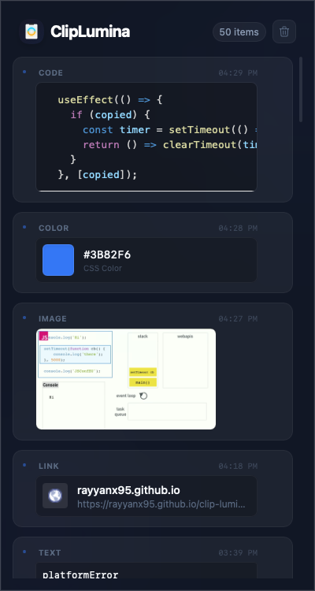

# ClipLumina 💡

**[🌐 Website & Installation Guide](https://RayyanX95.github.io/clip-lumina)**

<div align="center">
  
</div>

**ClipLumina** is a premium, high-performance clipboard manager for macOS. Built with **Tauri 2.0** and **Rust**, it is designed to be lightweight, secure, and privacy-first.

---

## 🚀 Key Features

- **Menu Bar Residency**: Stays hidden in your macOS menu bar for instant access.
- **Ultra-Lightweight Core**: Written in pure Rust for near-zero CPU and RAM usage.
- **Smart Detection**: Automatically detects and categorizes:
  - 🔗 **Links** (with domain favicon preview)
  - 💻 **Code Snippets** (with syntax highlighting)
  - 🎨 **Color Codes** (HEX/RGB/HSL with visual preview)
  - 🖼️ **Images & Files** (high-resolution thumbnails)
- **Local-First Persistence**: Your history stays on your machine via `tauri-plugin-store`.
- **Auto-Paste**: Simulated keystroke to paste content immediately upon selection.
- **Privacy by Design**: No telemetry, no cloud syncing, no tracking.

---

## 📦 Installation

### Download DMG

Grab the latest `.dmg` from the [Releases](https://github.com/RayyanX95/clip-lumina/releases) page.

> [!IMPORTANT]  
> **"ClipLumina is damaged and can't be opened"**  
> If you see this message, it is because the app is not signed by an Apple Developer account.
> To fix this, run the following command in your terminal:
>
> ```bash
> xattr -d com.apple.quarantine /Applications/ClipLumina.app
> ```

### Build from Source

If you prefer to build it yourself:

1. **Prerequisites**: [Rust](https://www.rust-lang.org/tools/install) and [Node.js](https://nodejs.org/).
2. **Clone the repo**:
   ```bash
   git clone https://github.com/RayyanX95/clip-lumina.git
   cd clip-lumina
   ```
3. **Install Dependencies**:
   ```bash
   npm install -g pnpm
   pnpm install
   ```
4. **Run in Development**:
   ```bash
   pnpm tauri dev
   ```
5. **Build Production DMG**:
   ```bash
   pnpm tauri build
   ```

### GitHub Releases

The project includes a GitHub Action to automate releases. To trigger a build:

1. Update version in `src-tauri/tauri.conf.json`.
2. Push a tag: `git tag -a v1.0.0 -m "v1.0.0" && git push origin v1.0.0`.

#### Required GitHub Secrets for macOS Signing:

To prevent the "damaged" error for all users, add these to your repo secrets:

- `APPLE_CERTIFICATE`: Base64 encoded `.p12` certificate.
- `APPLE_CERTIFICATE_PASSWORD`: Password for the `.p12`.
- `APPLE_ID`: Your Apple ID email.
- `APPLE_PASSWORD`: App-specific password from appleid.apple.com.
- `APPLE_TEAM_ID`: Your 10-character Team ID.

---

## 🛡️ Privacy & Security

ClipLumina handles your most sensitive data—your clipboard.

- **Open Source**: Verify the code yourself.
- **No Network Requests**: The core app does not communicate with any external servers.
- **Local Database**: All history is stored locally in your Application Support folder.

---

## 🗺️ Roadmap

- [ ] **Smart Folders**: Auto-categorization of permanent clips.
- [ ] **Fuzzy Search**: Search through thousands of clips instantly.
- [ ] **Lumina AI (Pro)**: Smart summaries and grammar refactoring (Server-side features).
- [ ] **Theme Engine**: Custom accent colors and glassmorphism settings.

---

## 📄 License

This project is licensed under the **MIT License** - see the [LICENSE](./LICENSE) file for details.

---

Created with ❤️ by the Lumina team.
